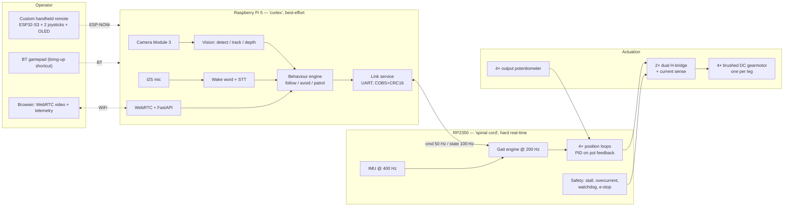

# Architecture — quaddle-robot

Retrofit of an APIDPOWER SMART DOG 18" toy quadruped into a programmable, AI-capable robot.
Keep the mechanics and the motors. Replace everything electrical above them.

See `HARDWARE_REFERENCE.md` for what is proven about the donor hardware and what is not.

---

## 1. Strategy: brain transplant

Four options were considered.

| Option | What it is | Verdict |
|---|---|---|
| **A. Sniff & replay the 2.4 GHz remote** | Reverse the RF protocol, transmit our own packets | **Rejected.** Buys only the toy's canned behaviours. No joint-level control, so no gaits, no balance, no closed loop — and therefore no meaningful AI layer. |
| **B. Piggyback the stock board** | Cut the JieLi SoC's traces to the MX1616S inputs, inject our own PWM into the existing H-bridges | **Fallback.** Cheapest, ~8 wires, keeps the toy's power tree. But the MX1616S current rating is unverified, there is no current sense, and we would be building on a board we cannot fully characterise. Acceptable only if Phase 0 shows low stall currents and we want a fast bring-up. |
| **C. Replace the electronics entirely** | Own driver board, own MCU, own power tree; the toy contributes chassis, linkages, motors | **CHOSEN (2026-08-03).** Additive and reversible — the stock PCB is unplugged, not cut. Meets the production-grade bar: current sense, thermal headroom, e-stop, telemetry, and a board we own the schematic for. |
| **D. Reflash the stock board's own MCU** | `U5` is an ARM MCU with an exposed `SWD`/`CLK`/`GND`/`VMCU` pad set (discovered 2026-08-03). Write our firmware to it and reuse its drivers, harness and power tree | **Excluded by the reversibility decision.** An unknown Chinese MCU is almost certainly read-protected, so flashing it means a mass erase — the stock firmware is then gone permanently, with no way to restore the toy. That is exactly what "additive, toy restorable" ruled out. Recorded here because the option is real: if the priority ever shifts from reversibility to speed, this is the cheapest path to custom motion, and the pads are already there. |

The stock PCB is retained intact as a reference and a rollback path. Nothing on it is cut,
desoldered or erased under Option C.

**What the board photo confirmed (2026-08-03):** the stock design is already a two-brain split —
JieLi SoC for Bluetooth/app/audio, separate ARM MCU (`U5`) for motion. Our architecture mirrors
theirs, which means the existing harness and connector pinout are laid out the way our RP2350
wants them. Good news for the wiring loom, whichever option is taken.

---

## 2. Two-brain split

Vision and language on Linux, motion on bare metal. Never run a gait loop on an OS that can
preempt it.



**Hard rule:** the Pi may only ever send *intent* — body velocity, pose, gait mode. It never
sends raw PWM. If the Pi hangs, crashes, or the link drops, the MCU independently ramps to a
stable stand and then disables the drivers. Autonomy that can be lost must not be autonomy
the robot depends on to stay safe.

---

## 3. Compute

| Role | Part | Why |
|---|---|---|
| Cortex | **Raspberry Pi 5, 8 GB** + active cooler | Enough CPU to run a small detector without an accelerator; PCIe for one if needed |
| AI accel *(optional)* | **AI HAT+ / Hailo-8L, 13 TOPS** | Only if Phase 5 measurement shows CPU inference below the frame-rate gate. Buy after measuring, not before. |
| Camera | **Camera Module 3** (autofocus) | CSI, no USB bandwidth contention |
| Spinal cord | **RP2350 (Pico 2)** | 8 PWM for 4 H-bridges and 4 ADC for 4 pots — the machine fits the chip exactly, with pins to spare for current sense, IMU and the Pi UART. Deterministic, no OS. Arif already has the Pico SDK + Debug Probe on this machine. |
| IMU | **BNO085** | On-chip sensor fusion — the MCU gets a quaternion, not a raw-gyro integration problem |
| Joint feedback | RP2350's **4 on-chip ADC channels** — exactly 4 legs | The `B103` pots wire straight in; no external ADC, no buffer. See §3b. Current sense then needs its own path — an **INA226** per rail on I²C rather than more ADC pins. |

> **Pico 2 module gotcha — check before Phase 1.** On the Raspberry Pi Pico / Pico 2 *board*,
> ADC3 (`GPIO29`) is tied to the on-board VSYS divider, so only **three** ADC channels are
> cleanly available on the module — one short of the four legs. `ASSUMED` from the Pico pinout;
> confirm against the datasheet before ordering. Three ways out, in preference order:
> **(a)** use the bare RP2350 on our own driver board (Option C already implies a custom PCB, and
> all four ADC channels are then free); **(b)** add an **ADS1015/MCP3008** and keep the module;
> **(c)** cut the VSYS divider on the module and lose battery sensing. Bring-up on a stock Pico 2
> can proceed on three legs — but do not discover this at wiring time.

### Bench inventory (2026-08-03) — most of the BOM is already in hand

| On the bench | Bearing on this project |
|---|---|
| **Raspberry Pi 5** (and Pi 4) | The chosen cortex. **No purchase needed for Phase 5.** |
| **Pico 2 W** | RP2350 — the chosen spinal cord, available now. Phase 1 can start as soon as a driver is chosen. **Caveat:** on the `W` variant `GPIO29`/ADC3 serves both the VSYS divider *and* the CYW43 radio, so only **`GPIO26–28` = 3 clean ADC channels** are free — one short of four legs. Fine for bring-up on three legs; the production board uses a bare RP2350 where all four are free. |
| **Pico W** | RP2040 spare / second target. |
| **ESP32-S3** | The Phase 4 handheld remote, and the untethered capture logger. Already the planned part. |
| **ESP32, ESP32-P4** | Spares. The P4 is over-specified for anything here. |
| **Arduino Uno** | 5 V-native, monotonic ADC — the safe first instrument for unmeasured signals. See `PHASE_0_SWD_AND_LOGIC.md` §2.1. |
| **STM32F4 Discovery, Nucleo** | Good 12-bit ADCs, but 3.3 V only and no advantage over the RP2350 here. Reserve. |

**Still to buy, and only after the measurement that selects it:** the H-bridge driver (needs Q3
stall current), an ADS1115 or MCP3008 if the ADC channel count binds, the IMU, the buck
converter, `B103` pot spares, and — only if Phase 5 measurement demands it — the AI accelerator.

Alternative considered and rejected for now: Jetson Orin Nano. More TOPS, but far worse
power budget on a battery this size and a heavier software stack for what is a 1-DOF-per-leg
machine.

---

## 3b. Motion architecture — **LOCKED: position control**

**Settled 2026-08-03.** Four actuators, one per leg. Each is a brushed DC motor into a gearbox
with an **output potentiometer**, and the output **sweeps a limited arc**. That is a servo built
from discrete parts, with the loop closed in firmware. The crank/phase-locked alternative that
was under consideration is dead — deleted, not deferred.

What this buys us over the alternative:

- **Absolute angle at power-on.** No homing sequence, no index hunt, no accumulated error. The
  robot knows its pose the instant the ADC is read — which also means a safe start is possible:
  read pose, ramp to a known stand, then accept commands.
- **Static poses are reachable.** Sit, lie, stand tall, bow, paw. A crank could not have held
  an arbitrary pose.
- **Body attitude control while standing.** Four leg positions → body height, pitch and roll
  (three outputs from four inputs, one redundant). Levelling on a slope and tilting to track a
  face are in scope. Not full dynamic balance — that needs the strafe DOF we do not have.

### Feedback front end — settled by the `B103 / 330°` pot

The sensor is a **10 kΩ linear pot with 330° electrical travel**, mounted in the gearbox
housing on the output side. Several design decisions fall straight out of that:

| Consequence | Detail |
|---|---|
| **No op-amp buffer needed** | Worst-case source impedance of a pot divider is R/4 = **2.5 kΩ**, comfortably inside the RP2350 ADC's sample-and-hold budget. Wire the wiper to the ADC pin with a small RC (1 kΩ + 10 nF) for anti-alias and ESD, nothing more. |
| **Measure ratiometrically** | Power the pot tops from the **same 3.3 V rail that feeds `ADC_VREF`**. Supply drift then cancels out of the reading entirely. |
| **The stock board already does this** | **Measured 2026-08-04: pot rail = 3.3 V, `VMCU` = 3.3 V.** The stock designer feeds the pots from the MCU's own regulated rail — exactly the ratiometric arrangement we planned. Our board mirrors it. |
| **Zero signal conditioning** | A 0–3.3 V wiper into a 3.3 V-referenced ADC needs no divider, no level shift, no buffer. The front end is a wire and an RC. |
| **Negligible load** | 3.3 V / 10 kΩ = 0.33 mA per pot, 1.3 mA for all four. Leave them powered continuously; no switching needed. |
| **Resolution** | 12-bit over the full 330° = **0.081°/count**. A leg arc of ~90° therefore spans ~1100 counts. With 4× oversampling and a median filter, real resolution lands near 0.05° — far finer than the gearbox backlash. Resolution is not the limiting factor here; mechanical slop is. |
| **The pot reads the *output*, not the motor** | The loop closes on true leg position, so gear backlash sits *inside* the loop rather than corrupting the measurement. This is the right place for it, and it is why a modest PID will work. It also means the loop must tolerate the deadband as the gears reverse — hence the slew and deadband rules below. |
| **Spares** | `B103` 330° pots are a commodity part. Order a handful with the first BOM; a scratchy track is the most likely long-run failure and it is not worth debugging in software. |

Calibration maps ADC counts → leg angle → foot position per leg (Q9). Nothing in firmware ever
hard-codes a count value; all four legs get their own table.

### Control stack per leg

```
pot → ADC (12-bit, 4× oversampled) → angle
                                        ↓
target angle → slew limiter → PID → PWM magnitude + direction → H-bridge
                                        ↑
                     current sense (stall detect, torque estimate)
```

- 200 Hz loop, all four legs in one timer callback.
- **Deadband and slew limits are not optional.** A nylon toy gearbox against a PID with any
  integral term will chatter and strip teeth. Setpoints are rate-limited before the loop sees
  them; the loop output is slew-limited before the driver sees it.
- Software angle limits sit 5° inside the measured mechanical stops (Q5), enforced below the
  trajectory generator so no command path can bypass them.
- Stall = current above threshold **and** angle not changing. Both conditions, for 200 ms, then
  cut that channel and raise a fault. Current alone false-trips on acceleration.

### The leg model is measured, not derived (Q9)

One actuator per leg means the foot travels a **fixed 1-D curve**, parameterised by pot angle.
That curve is the entire kinematic model — there is no IK to solve, just a lookup:

    foot_x, foot_z  =  legpath(theta)

Calibrate it once per leg: command a sweep in steps, photograph or measure the foot position at
each step, fit a curve, store the table. Gait design then reduces to choosing a `theta(t)`
profile per leg plus four phase offsets. All of it is pure arithmetic and gets host-native unit
tests before it touches hardware.

## 4. Motor drive — decided in Phase 0, not before

Selection is a direct function of the measured stall current (Q3).

| Measured stall | Driver | Notes |
|---|---|---|
| < 1.5 A | 2 × **DRV8833** | Dual bridge, 10.8 V max, integrated current limit — 4 channels covers the legs |
| 1.5 – 3 A | 2 × **TB6612FNG** | 1.2 A cont / 3.2 A peak per channel |
| > 3 A | 4 × **DRV8871** | Single bridge, 3.6 A, adjustable current limit |

Quantities assume 4 leg motors only. Add channels once Q8 accounts for head/tail/mouth motors.

Every channel gets a sense resistor into an **INA226** (or the driver's own sense pin) so the
MCU can detect stall from current, not from a timeout guess.

---

## 5. Power tree

Draft — finalised once Q4 (battery) is measured.

```
[2S/3S Li-ion pack + BMS]
   ├── e-stop / master switch ── motor rail (direct, fused) ──> H-bridges
   └── 5 V 5 A buck ──┬──> Raspberry Pi 5
                      ├──> RP2350 (3V3 via its own LDO)
                      └──> IMU, camera, sensors
```

- Pi 5 and the motor rail share only the battery, never a regulator. Motor transients must
  not brown out the Pi.
- INA226 on the pack for state-of-charge telemetry and a low-voltage cutoff.
- The stock toy charge circuit is not reused until Q4 is answered.

---

## 6. Pi ↔ MCU link

UART, 460800 baud, **COBS** framing, **CRC-16/CCITT** trailer. Binary structs, little-endian,
versioned by a leading protocol byte.

- **Command, Pi → MCU, 50 Hz:** `{seq, mode, v_fwd, w_turn, gait, stride_scale, flags}` — one DOF per
  leg means there is no `vy` (strafe) and no independent body roll to command.
- **State, MCU → Pi, 100 Hz:** `{seq, leg_pos[4], leg_current[4], quaternion, batt_mV, fault_bits, mode}`
  where `leg_pos` is crank phase (Branch A) or joint angle (Branch B).
- **Deadman:** MCU expects a command frame at least every 100 ms. Miss three → ramp to stand,
  disable drivers, raise `fault_bits.LINK_LOST`.

Sequence numbers are echoed so the Pi can measure true round-trip latency instead of assuming it.

---

## 7. Operator control

**Decided 2026-08-03:** both the custom handheld remote and the browser app are shipping
deliverables. The gamepad is a bring-up tool, not a deliverable.

Delivered in this order — each stage is usable on its own.

1. **BT gamepad → Pi** (evdev). *Bring-up only.* Fastest path to a driveable robot; exists to
   validate the gaits in Phase 3 before either real controller is built.
2. **Custom handheld remote** — ESP32-S3, two analogue sticks, OLED showing battery / mode /
   fault, ESP-NOW to an ESP32 receiver on the robot or straight to the Pi's WiFi. **Deliverable.**
3. **Browser** — FastAPI + WebRTC, live camera with detection overlay, telemetry, mode switch.
   **Deliverable.** The demo surface, and the only control path that shows what the AI sees.

Contention rule: exactly one path holds control at a time. The MCU tracks a `control_owner`
field; a second path may observe telemetry but its intent frames are dropped until it
explicitly takes ownership, and taking ownership always passes through a stand.

All three converge on the same intent struct in §6. No control path gets its own privileged
command channel.

---

## 8. Software layout

```
firmware/          RP2350, C + Pico SDK, CMake
  src/gait/        gait generator, leg IK
  src/joint/       per-joint control + feedback
  src/safety/      stall, overcurrent, watchdog, e-stop
  src/link/        COBS + CRC framing
  test/            host-native unit tests (gait math, framing, CRC)

host/              Raspberry Pi 5, Python 3.12, uv
  link/            serial transport, protocol codec
  vision/          camera pipeline, detector, tracker
  behaviour/       follow, avoid, patrol state machines
  api/             FastAPI + WebRTC
  tests/           pytest

remote/            ESP32-S3 handheld, ESP-IDF
```

Gait math and the protocol codec are pure functions with host-native tests. They are never
debugged on hardware.

**ROS 2:** not adopted now — the payload does not justify the weight on a 1-DOF-per-leg
machine. The `host/` boundaries are drawn so a ROS 2 bridge can be bolted on later without
restructuring.

---

## 9. Principal risks

| Risk | Impact | Mitigation |
|---|---|---|
| ~~Q1 = index-only sensor~~ | — | **Closed 2026-08-03: the sensor is a potentiometer.** Absolute angle, no homing. This risk is retired. |
| **Pot wear and noise** | Toy pots are carbon-track and will get scratchy; a noisy wiper reads as a position step and the PID answers with a torque spike | Oversample and median-filter in the ADC path; rate-limit the loop output; reject single-sample jumps larger than physically possible at max slew. Budget for replacing the pots. |
| Toy gearboxes not built for closed-loop duty | Stripped nylon gears under PID chatter | Conservative current limits, rate-limited setpoints, stall timeout in firmware from Phase 1 |
| Pi 5 + motors exceed pack capacity | Runtime measured in minutes | Measure real draw in Phase 5; larger pack or a tethered bench supply for development |
| **1 DOF per leg** (`PROVEN` 2026-08-03, pending the Q2/Q8 connector count) | No strafe, no abduction, no dynamic balance. Quaddle-class tricks — backflips, ceiling walking — are **not** reachable on this chassis. | Accept and scope to it: walk, turn, speed, static poses, and body height/pitch/roll while standing. Set expectations now, not at Phase 3. If the connector count comes back as 8, revisit — 2 DOF/leg changes this row entirely. |
| Chinese toy, no spares | A stripped gearbox could end the project | Source a second identical unit as a parts donor early, while stock exists |
